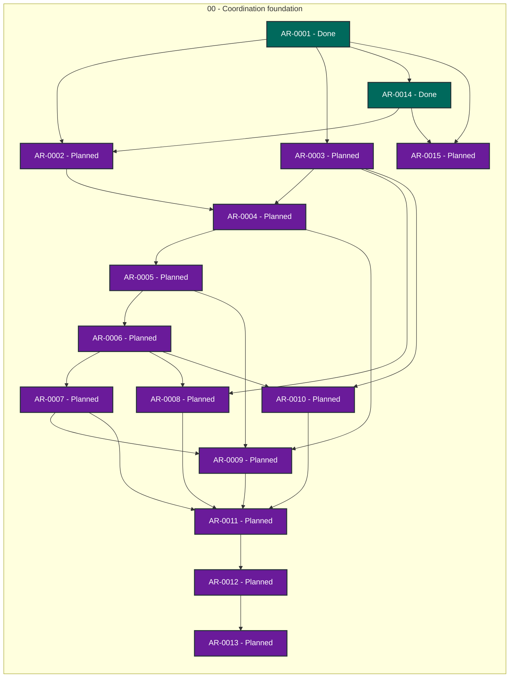

# Agent Workflow TUI status

> Generated deterministically from task front matter. Do not edit this file directly.
> Status records coordination progress; it is not evidence that product behavior is accepted.

## Portfolio overview

**15 ARs tracked** across 2 active status categories.

| Status | Meaning | Count |
| --- | --- | ---: |
| **In progress** | Claimed work with a live lease | 0 |
| **Open** | Dependency-ready and available to claim | 0 |
| **Blocked** | Cannot proceed until its recorded blocker clears | 0 |
| **Planned** | Defined work awaiting promotion or dependencies | 13 |
| **Future** | Deferred roadmap work | 0 |
| **Done** | Accepted, integrated, and durably verified | 2 |
| **Cancelled** | Stopped with a recorded rationale | 0 |
| **Superseded** | Replaced by another AR | 0 |

## Dependency graph

Arrows point from each prerequisite to the work that depends on it. Color is redundant
with the status text inside every node; the tables below are the complete text
alternative.

### Accessible dependency index

| AR | Prerequisites | Dependents |
| --- | --- | --- |
| [AR-0001](tasks/AR-0001.md) | None | [AR-0002](tasks/AR-0002.md), [AR-0003](tasks/AR-0003.md), [AR-0014](tasks/AR-0014.md), [AR-0015](tasks/AR-0015.md) |
| [AR-0002](tasks/AR-0002.md) | [AR-0001](tasks/AR-0001.md), [AR-0014](tasks/AR-0014.md) | [AR-0004](tasks/AR-0004.md) |
| [AR-0003](tasks/AR-0003.md) | [AR-0001](tasks/AR-0001.md) | [AR-0004](tasks/AR-0004.md), [AR-0008](tasks/AR-0008.md), [AR-0010](tasks/AR-0010.md) |
| [AR-0004](tasks/AR-0004.md) | [AR-0002](tasks/AR-0002.md), [AR-0003](tasks/AR-0003.md) | [AR-0005](tasks/AR-0005.md), [AR-0009](tasks/AR-0009.md) |
| [AR-0005](tasks/AR-0005.md) | [AR-0004](tasks/AR-0004.md) | [AR-0006](tasks/AR-0006.md), [AR-0009](tasks/AR-0009.md) |
| [AR-0006](tasks/AR-0006.md) | [AR-0005](tasks/AR-0005.md) | [AR-0007](tasks/AR-0007.md), [AR-0008](tasks/AR-0008.md), [AR-0010](tasks/AR-0010.md) |
| [AR-0007](tasks/AR-0007.md) | [AR-0006](tasks/AR-0006.md) | [AR-0009](tasks/AR-0009.md), [AR-0011](tasks/AR-0011.md) |
| [AR-0008](tasks/AR-0008.md) | [AR-0003](tasks/AR-0003.md), [AR-0006](tasks/AR-0006.md) | [AR-0011](tasks/AR-0011.md) |
| [AR-0009](tasks/AR-0009.md) | [AR-0004](tasks/AR-0004.md), [AR-0005](tasks/AR-0005.md), [AR-0007](tasks/AR-0007.md) | [AR-0011](tasks/AR-0011.md) |
| [AR-0010](tasks/AR-0010.md) | [AR-0003](tasks/AR-0003.md), [AR-0006](tasks/AR-0006.md) | [AR-0011](tasks/AR-0011.md) |
| [AR-0011](tasks/AR-0011.md) | [AR-0007](tasks/AR-0007.md), [AR-0008](tasks/AR-0008.md), [AR-0009](tasks/AR-0009.md), [AR-0010](tasks/AR-0010.md) | [AR-0012](tasks/AR-0012.md) |
| [AR-0012](tasks/AR-0012.md) | [AR-0011](tasks/AR-0011.md) | [AR-0013](tasks/AR-0013.md) |
| [AR-0013](tasks/AR-0013.md) | [AR-0012](tasks/AR-0012.md) | None |
| [AR-0014](tasks/AR-0014.md) | [AR-0001](tasks/AR-0001.md) | [AR-0002](tasks/AR-0002.md), [AR-0015](tasks/AR-0015.md) |
| [AR-0015](tasks/AR-0015.md) | [AR-0001](tasks/AR-0001.md), [AR-0014](tasks/AR-0014.md) | None |

## Complete AR inventory

### Planned (13)

| Priority | AR | Owner | Summary | Next action |
| --- | --- | --- | --- | --- |
| P0 | [AR-0002](tasks/AR-0002.md): Interactive TUI shell | Unclaimed | Build the minimal interactive terminal shell. | Implement only the terminal shell lifecycle and bounded input loop. |
| P0 | [AR-0003](tasks/AR-0003.md): AR context and TUI event adapter | Unclaimed | Create the revision-bound input/output protocol between ARs and the TUI. | Implement strict AR context and typed TUI event envelopes with stale/cross-AR rejection. |
| P0 | [AR-0008](tasks/AR-0008.md): Coordinator lifecycle adapter | Unclaimed | Integrate the TUI with Coordinator as AR lifecycle authority. | Bind accepted TUI events to Coordinator task revisions, lifecycle transitions, and durable event references. |
| P0 | [AR-0009](tasks/AR-0009.md): AWG decision adapter | Unclaimed | Integrate TUI interaction with AWG decision semantics. | Consume AWG packet/decision/reconciliation contracts and emit provenance-preserving decision records. |
| P0 | [AR-0010](tasks/AR-0010.md): AWQ quality and evidence adapter | Unclaimed | Integrate quality and evidence gates without turning them into user intent. | Integrate AWQ checks for schema, privacy, formal evidence, rendering, persistence, and truthful limitations. |
| P0 | [AR-0015](tasks/AR-0015.md): AR/TUI envelope contract | Unclaimed | Define revision-bound TUI input and output envelopes. | Define strict AR context and TUI event envelope schemas. |
| P1 | [AR-0004](tasks/AR-0004.md): Discussion packet presentation | Unclaimed | Present privacy-safe discussion packets in the TUI. | Render AWG discussion packets with ranked alternatives, confidence, implications, and formal evidence. |
| P1 | [AR-0005](tasks/AR-0005.md): Decision and proposal interaction | Unclaimed | Capture explicit oracle decisions and added solutions without cross-point authorization. | Implement per-point selection, rejection, clarification, and evaluated user-authored alternatives. |
| P1 | [AR-0006](tasks/AR-0006.md): Session persistence and recovery | Unclaimed | Persist complete TUI sessions and return durable output to ARs. | Implement atomic session journal, safe exit, resume, re-ask, and bounded future-request mapping. |
| P1 | [AR-0007](tasks/AR-0007.md): Conflict reconciliation and reopen UI | Unclaimed | Provide explicit post-discussion conflict solution and reopen interaction. | Implement conflict/reconciliation views, targeted reopen, contradiction display, and AR continuation events. |
| P1 | [AR-0011](tasks/AR-0011.md): Cross-project integration harness | Unclaimed | Verify cross-project TUI composition and hostile fail-closed traces. | Run deterministic offline composition tests across Coordinator, AWG, and AWQ public contracts. |
| P1 | [AR-0012](tasks/AR-0012.md): End-to-end runtime verification | Unclaimed | Prove runtime behavior and AR input/output round trips. | Exercise the real terminal application with recorded input, end-to-end AR fixtures, and recovery scenarios. |
| P1 | [AR-0013](tasks/AR-0013.md): Release and operational qualification | Unclaimed | Publish a reproducible, supported TUI release. | Harden packaging, platform support, accessibility, privacy, signed release, and installation documentation. |

### Done (2)

| Priority | AR | Owner | Summary | Next action |
| --- | --- | --- | --- | --- |
| P0 | [AR-0001](tasks/AR-0001.md): TUI bootstrap and ownership review | Unclaimed | Bootstrap TUI ownership and implementation boundary. | Review the TUI project boundary and approve the split lifecycle and envelope contracts. |
| P0 | [AR-0014](tasks/AR-0014.md): Formal TUI lifecycle model | Unclaimed | Define the formal TUI lifecycle state machine. | Formalize the finite AR/TUI lifecycle and fail-closed transitions. |
