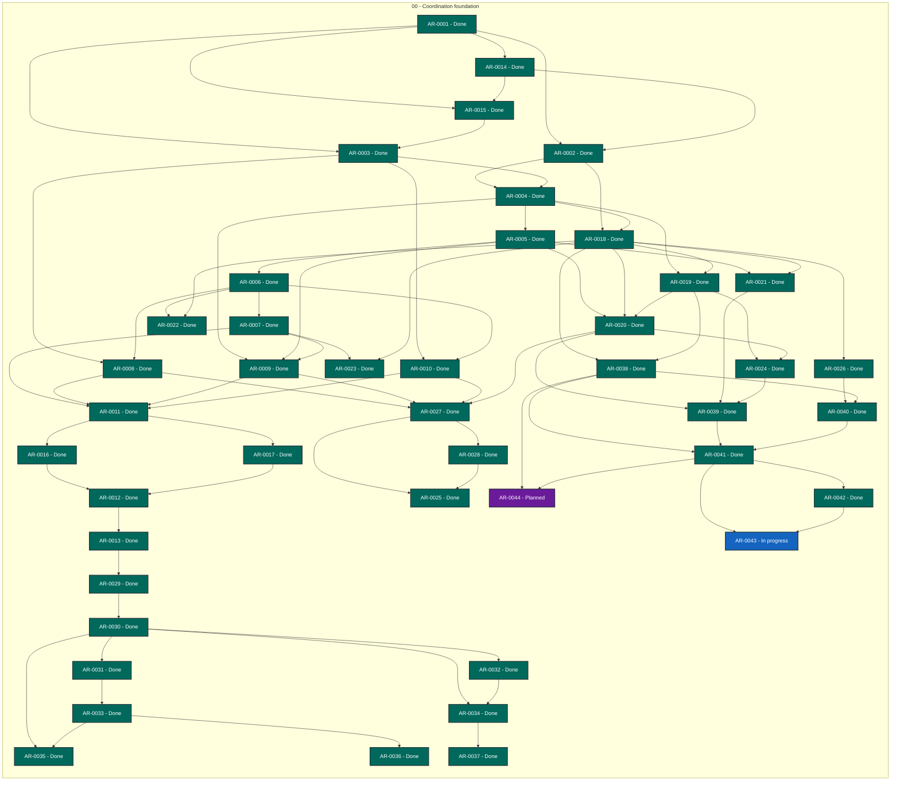

# Agent Workflow TUI status

> Generated deterministically from task front matter. Do not edit this file directly.
> Status records coordination progress; it is not evidence that product behavior is accepted.

## Portfolio overview

**44 ARs tracked** across 3 active status categories.

| Status | Meaning | Count |
| --- | --- | ---: |
| **In progress** | Claimed work with a live lease | 1 |
| **Open** | Dependency-ready and available to claim | 0 |
| **Blocked** | Cannot proceed until its recorded blocker clears | 0 |
| **Planned** | Defined work awaiting promotion or dependencies | 1 |
| **Future** | Deferred roadmap work | 0 |
| **Done** | Accepted, integrated, and durably verified | 42 |
| **Cancelled** | Stopped with a recorded rationale | 0 |
| **Superseded** | Replaced by another AR | 0 |

## Dependency graph

Arrows point from each prerequisite to the work that depends on it. Color is redundant
with the status text inside every node; the tables below are the complete text
alternative.

### Accessible dependency index

| AR | Prerequisites | Dependents |
| --- | --- | --- |
| [AR-0001](tasks/AR-0001.md) | None | [AR-0002](tasks/AR-0002.md), [AR-0003](tasks/AR-0003.md), [AR-0014](tasks/AR-0014.md), [AR-0015](tasks/AR-0015.md) |
| [AR-0002](tasks/AR-0002.md) | [AR-0001](tasks/AR-0001.md), [AR-0014](tasks/AR-0014.md) | [AR-0004](tasks/AR-0004.md), [AR-0018](tasks/AR-0018.md) |
| [AR-0003](tasks/AR-0003.md) | [AR-0001](tasks/AR-0001.md), [AR-0015](tasks/AR-0015.md) | [AR-0004](tasks/AR-0004.md), [AR-0008](tasks/AR-0008.md), [AR-0010](tasks/AR-0010.md) |
| [AR-0004](tasks/AR-0004.md) | [AR-0002](tasks/AR-0002.md), [AR-0003](tasks/AR-0003.md) | [AR-0005](tasks/AR-0005.md), [AR-0009](tasks/AR-0009.md), [AR-0018](tasks/AR-0018.md), [AR-0019](tasks/AR-0019.md) |
| [AR-0005](tasks/AR-0005.md) | [AR-0004](tasks/AR-0004.md) | [AR-0006](tasks/AR-0006.md), [AR-0009](tasks/AR-0009.md), [AR-0020](tasks/AR-0020.md), [AR-0021](tasks/AR-0021.md) |
| [AR-0006](tasks/AR-0006.md) | [AR-0005](tasks/AR-0005.md) | [AR-0007](tasks/AR-0007.md), [AR-0008](tasks/AR-0008.md), [AR-0010](tasks/AR-0010.md), [AR-0022](tasks/AR-0022.md) |
| [AR-0007](tasks/AR-0007.md) | [AR-0006](tasks/AR-0006.md) | [AR-0009](tasks/AR-0009.md), [AR-0011](tasks/AR-0011.md), [AR-0023](tasks/AR-0023.md) |
| [AR-0008](tasks/AR-0008.md) | [AR-0003](tasks/AR-0003.md), [AR-0006](tasks/AR-0006.md) | [AR-0011](tasks/AR-0011.md), [AR-0027](tasks/AR-0027.md) |
| [AR-0009](tasks/AR-0009.md) | [AR-0004](tasks/AR-0004.md), [AR-0005](tasks/AR-0005.md), [AR-0007](tasks/AR-0007.md) | [AR-0011](tasks/AR-0011.md), [AR-0027](tasks/AR-0027.md) |
| [AR-0010](tasks/AR-0010.md) | [AR-0003](tasks/AR-0003.md), [AR-0006](tasks/AR-0006.md) | [AR-0011](tasks/AR-0011.md), [AR-0027](tasks/AR-0027.md) |
| [AR-0011](tasks/AR-0011.md) | [AR-0007](tasks/AR-0007.md), [AR-0008](tasks/AR-0008.md), [AR-0009](tasks/AR-0009.md), [AR-0010](tasks/AR-0010.md) | [AR-0016](tasks/AR-0016.md), [AR-0017](tasks/AR-0017.md) |
| [AR-0012](tasks/AR-0012.md) | [AR-0016](tasks/AR-0016.md), [AR-0017](tasks/AR-0017.md) | [AR-0013](tasks/AR-0013.md) |
| [AR-0013](tasks/AR-0013.md) | [AR-0012](tasks/AR-0012.md) | [AR-0029](tasks/AR-0029.md) |
| [AR-0014](tasks/AR-0014.md) | [AR-0001](tasks/AR-0001.md) | [AR-0002](tasks/AR-0002.md), [AR-0015](tasks/AR-0015.md) |
| [AR-0015](tasks/AR-0015.md) | [AR-0001](tasks/AR-0001.md), [AR-0014](tasks/AR-0014.md) | [AR-0003](tasks/AR-0003.md) |
| [AR-0016](tasks/AR-0016.md) | [AR-0011](tasks/AR-0011.md) | [AR-0012](tasks/AR-0012.md) |
| [AR-0017](tasks/AR-0017.md) | [AR-0011](tasks/AR-0011.md) | [AR-0012](tasks/AR-0012.md) |
| [AR-0018](tasks/AR-0018.md) | [AR-0002](tasks/AR-0002.md), [AR-0004](tasks/AR-0004.md) | [AR-0019](tasks/AR-0019.md), [AR-0020](tasks/AR-0020.md), [AR-0021](tasks/AR-0021.md), [AR-0022](tasks/AR-0022.md), [AR-0023](tasks/AR-0023.md), [AR-0026](tasks/AR-0026.md), [AR-0038](tasks/AR-0038.md) |
| [AR-0019](tasks/AR-0019.md) | [AR-0004](tasks/AR-0004.md), [AR-0018](tasks/AR-0018.md) | [AR-0020](tasks/AR-0020.md), [AR-0024](tasks/AR-0024.md), [AR-0038](tasks/AR-0038.md) |
| [AR-0020](tasks/AR-0020.md) | [AR-0005](tasks/AR-0005.md), [AR-0018](tasks/AR-0018.md), [AR-0019](tasks/AR-0019.md) | [AR-0024](tasks/AR-0024.md), [AR-0027](tasks/AR-0027.md), [AR-0039](tasks/AR-0039.md) |
| [AR-0021](tasks/AR-0021.md) | [AR-0005](tasks/AR-0005.md), [AR-0018](tasks/AR-0018.md) | [AR-0039](tasks/AR-0039.md) |
| [AR-0022](tasks/AR-0022.md) | [AR-0006](tasks/AR-0006.md), [AR-0018](tasks/AR-0018.md) | None |
| [AR-0023](tasks/AR-0023.md) | [AR-0007](tasks/AR-0007.md), [AR-0018](tasks/AR-0018.md) | None |
| [AR-0024](tasks/AR-0024.md) | [AR-0019](tasks/AR-0019.md), [AR-0020](tasks/AR-0020.md) | [AR-0039](tasks/AR-0039.md) |
| [AR-0025](tasks/AR-0025.md) | [AR-0027](tasks/AR-0027.md), [AR-0028](tasks/AR-0028.md) | None |
| [AR-0026](tasks/AR-0026.md) | [AR-0018](tasks/AR-0018.md) | [AR-0040](tasks/AR-0040.md) |
| [AR-0027](tasks/AR-0027.md) | [AR-0008](tasks/AR-0008.md), [AR-0009](tasks/AR-0009.md), [AR-0010](tasks/AR-0010.md), [AR-0020](tasks/AR-0020.md) | [AR-0025](tasks/AR-0025.md), [AR-0028](tasks/AR-0028.md) |
| [AR-0028](tasks/AR-0028.md) | [AR-0027](tasks/AR-0027.md) | [AR-0025](tasks/AR-0025.md) |
| [AR-0029](tasks/AR-0029.md) | [AR-0013](tasks/AR-0013.md) | [AR-0030](tasks/AR-0030.md) |
| [AR-0030](tasks/AR-0030.md) | [AR-0029](tasks/AR-0029.md) | [AR-0031](tasks/AR-0031.md), [AR-0032](tasks/AR-0032.md), [AR-0034](tasks/AR-0034.md), [AR-0035](tasks/AR-0035.md) |
| [AR-0031](tasks/AR-0031.md) | [AR-0030](tasks/AR-0030.md) | [AR-0033](tasks/AR-0033.md) |
| [AR-0032](tasks/AR-0032.md) | [AR-0030](tasks/AR-0030.md) | [AR-0034](tasks/AR-0034.md) |
| [AR-0033](tasks/AR-0033.md) | [AR-0031](tasks/AR-0031.md) | [AR-0035](tasks/AR-0035.md), [AR-0036](tasks/AR-0036.md) |
| [AR-0034](tasks/AR-0034.md) | [AR-0030](tasks/AR-0030.md), [AR-0032](tasks/AR-0032.md) | [AR-0037](tasks/AR-0037.md) |
| [AR-0035](tasks/AR-0035.md) | [AR-0030](tasks/AR-0030.md), [AR-0033](tasks/AR-0033.md) | None |
| [AR-0036](tasks/AR-0036.md) | [AR-0033](tasks/AR-0033.md) | None |
| [AR-0037](tasks/AR-0037.md) | [AR-0034](tasks/AR-0034.md) | None |
| [AR-0038](tasks/AR-0038.md) | [AR-0018](tasks/AR-0018.md), [AR-0019](tasks/AR-0019.md) | [AR-0040](tasks/AR-0040.md), [AR-0041](tasks/AR-0041.md), [AR-0044](tasks/AR-0044.md) |
| [AR-0039](tasks/AR-0039.md) | [AR-0020](tasks/AR-0020.md), [AR-0021](tasks/AR-0021.md), [AR-0024](tasks/AR-0024.md) | [AR-0041](tasks/AR-0041.md) |
| [AR-0040](tasks/AR-0040.md) | [AR-0026](tasks/AR-0026.md), [AR-0038](tasks/AR-0038.md) | [AR-0041](tasks/AR-0041.md) |
| [AR-0041](tasks/AR-0041.md) | [AR-0038](tasks/AR-0038.md), [AR-0039](tasks/AR-0039.md), [AR-0040](tasks/AR-0040.md) | [AR-0042](tasks/AR-0042.md), [AR-0043](tasks/AR-0043.md), [AR-0044](tasks/AR-0044.md) |
| [AR-0042](tasks/AR-0042.md) | [AR-0041](tasks/AR-0041.md) | [AR-0043](tasks/AR-0043.md) |
| [AR-0043](tasks/AR-0043.md) | [AR-0041](tasks/AR-0041.md), [AR-0042](tasks/AR-0042.md) | None |
| [AR-0044](tasks/AR-0044.md) | [AR-0038](tasks/AR-0038.md), [AR-0041](tasks/AR-0041.md) | None |

## Complete AR inventory

### In progress (1)

| Priority | AR | Owner | Summary | Next action |
| --- | --- | --- | --- | --- |
| P0 | [AR-0043](tasks/AR-0043.md): Live scenario runner parity | codex-awt-ar0043-20260917 | Ensure scenario screenshots exercise the real multi-pane TUI model. | Instantiate the live application model for each scenario replay and include document/decision state in generated demos. |

### Planned (1)

| Priority | AR | Owner | Summary | Next action |
| --- | --- | --- | --- | --- |
| P0 | [AR-0044](tasks/AR-0044.md): Markdown document rendering | Unclaimed | Make document panes real Markdown terminal views. | Render Markdown design/workplan documents through a pinned terminal Markdown renderer in the live TUI and demos. |

### Done (42)

| Priority | AR | Owner | Summary | Next action |
| --- | --- | --- | --- | --- |
| P0 | [AR-0001](tasks/AR-0001.md): TUI bootstrap and ownership review | Unclaimed | Bootstrap TUI ownership and implementation boundary. | Review the TUI project boundary and approve the split lifecycle and envelope contracts. |
| P0 | [AR-0002](tasks/AR-0002.md): Interactive TUI shell | Unclaimed | Build the minimal interactive terminal shell. | Implement only the terminal shell lifecycle and bounded input loop. |
| P0 | [AR-0003](tasks/AR-0003.md): TUI event adapter implementation | Unclaimed | Connect revision-bound envelopes to TUI session boundaries. | Implement adapter transport and predecessor validation on top of the strict envelope schemas. |
| P0 | [AR-0008](tasks/AR-0008.md): Coordinator lifecycle adapter | Unclaimed | Integrate the TUI with Coordinator as AR lifecycle authority. | Bind accepted TUI events to Coordinator task revisions, lifecycle transitions, and durable event references. |
| P0 | [AR-0009](tasks/AR-0009.md): AWG decision adapter | Unclaimed | Integrate TUI interaction with AWG decision semantics. | Consume AWG packet/decision/reconciliation contracts and emit provenance-preserving decision records. |
| P0 | [AR-0010](tasks/AR-0010.md): AWQ quality and evidence adapter | Unclaimed | Integrate quality and evidence gates without turning them into user intent. | Integrate AWQ checks for schema, privacy, formal evidence, rendering, persistence, and truthful limitations. |
| P0 | [AR-0014](tasks/AR-0014.md): Formal TUI lifecycle model | Unclaimed | Define the formal TUI lifecycle state machine. | Formalize the finite AR/TUI lifecycle and fail-closed transitions. |
| P0 | [AR-0015](tasks/AR-0015.md): AR/TUI envelope contract | Unclaimed | Define revision-bound TUI input and output envelopes. | Define strict AR context and TUI event envelope schemas. |
| P0 | [AR-0018](tasks/AR-0018.md): Two-pane navigation and highlighting | Unclaimed | Build the actual two-pane discussion navigation UI. | Implement the two-pane document/discussion-point renderer, navigation, anchors, focus, resize, and unresolved highlighting. |
| P0 | [AR-0025](tasks/AR-0025.md): Live AR/TUI session transport | Unclaimed | Connect the full TUI session to autonomous AR execution. | Integrate completed transport sub-ARs into end-to-end autonomous session orchestration. |
| P0 | [AR-0026](tasks/AR-0026.md): Live TUI toolkit foundation | Unclaimed | Establish the toolkit-backed live TUI foundation. | Select and pin a suitable Python TUI/input toolkit, implement the live application event loop, and provide deterministic headless tests plus fallback behavior. |
| P0 | [AR-0027](tasks/AR-0027.md): Session transport envelopes | Unclaimed | Define live TUI transport identity and acknowledgements. | Implement revision-bound session envelopes, event acknowledgements, and adapter correlation. |
| P0 | [AR-0028](tasks/AR-0028.md): Transport retries and stale rejection | Unclaimed | Make live transport retryable and stale-event safe. | Implement bounded retries and fail-closed handling for stale or rejected events. |
| P0 | [AR-0038](tasks/AR-0038.md): Live document navigation and decision focus | Unclaimed | Make document navigation and decision selection usable live. | Implement real workplan/design document panes, switching, decision selection, and visual highlighting in the live TUI. |
| P0 | [AR-0039](tasks/AR-0039.md): Live proposal and batch interaction | Unclaimed | Make every decision and proposal interaction usable live. | Implement real proposal selection, helper updates, batch decisions, and user-authored proposal input. |
| P0 | [AR-0040](tasks/AR-0040.md): Terminal lifecycle cleanup | Unclaimed | Make live TUI startup and shutdown clean and reversible. | Restore terminal state on every exit path and leave only concise final output. |
| P0 | [AR-0041](tasks/AR-0041.md): Live scenario demo parity | Unclaimed | Prove scenario demos exercise the complete live UI. | Drive representative corpus scenarios through demo packets with multiple decisions and verify clean interactive completion. |
| P0 | [AR-0042](tasks/AR-0042.md): Default live demo and anchor highlighting | Unclaimed | Make the standalone TUI immediately demonstrate the complete interaction model. | Show a multi-decision workplan/design demo by default and visibly mark the active document anchor. |
| P1 | [AR-0004](tasks/AR-0004.md): Discussion packet presentation | Unclaimed | Present privacy-safe discussion packets in the TUI. | Render AWG discussion packets with ranked alternatives, confidence, implications, and formal evidence. |
| P1 | [AR-0005](tasks/AR-0005.md): Decision and proposal interaction | Unclaimed | Capture explicit oracle decisions and added solutions without cross-point authorization. | Implement per-point selection, rejection, clarification, and evaluated user-authored alternatives. |
| P1 | [AR-0006](tasks/AR-0006.md): Session persistence and recovery | Unclaimed | Persist complete TUI sessions and return durable output to ARs. | Implement atomic session journal, safe exit, resume, re-ask, and bounded future-request mapping. |
| P1 | [AR-0007](tasks/AR-0007.md): Conflict reconciliation and reopen UI | Unclaimed | Provide explicit post-discussion conflict solution and reopen interaction. | Implement conflict/reconciliation views, targeted reopen, contradiction display, and AR continuation events. |
| P1 | [AR-0011](tasks/AR-0011.md): Cross-project integration harness | Unclaimed | Verify cross-project TUI composition and hostile fail-closed traces. | Run deterministic offline composition tests across Coordinator, AWG, and AWQ public contracts. |
| P1 | [AR-0012](tasks/AR-0012.md): Runtime verification orchestration | Unclaimed | Orchestrate runtime verification evidence and AR round trips. | Integrate the recorded-input and recovery runtime evidence into one release-bound report. |
| P1 | [AR-0013](tasks/AR-0013.md): Release and operational qualification | Unclaimed | Publish a reproducible, supported TUI release. | Harden packaging, platform support, accessibility, privacy, signed release, and installation documentation. |
| P1 | [AR-0016](tasks/AR-0016.md): Recorded terminal runtime tests | Unclaimed | Verify normal terminal runtime behavior against public contracts. | Drive the real TUI through recorded terminal input for a complete discussion-to-event round trip. |
| P1 | [AR-0017](tasks/AR-0017.md): Recovery and reopen runtime tests | Unclaimed | Verify runtime recovery and conflict-reopen behavior. | Exercise interrupted save, stale resume, unresolved conflict, targeted reopen, and re-ask runtime paths. |
| P1 | [AR-0019](tasks/AR-0019.md): Proposal and implication helper view | Unclaimed | Render the decision helper view beside the discussion panes. | Implement the helper view for ranked proposals, implications, confidence, trade-offs, evidence gaps, and affected ARs. |
| P1 | [AR-0020](tasks/AR-0020.md): Interactive decision controls | Unclaimed | Connect terminal input to explicit per-point decision and reconciliation events. | Implement keyboard/user-input controls for select, reject, clarify, add proposal, safe exit, and reopen. |
| P1 | [AR-0021](tasks/AR-0021.md): Batched discussion UI | Unclaimed | Implement batched discussion interaction in the terminal UI. | Render batched independent discussion points, coupling warnings, partial responses, and per-point status in the live TUI. |
| P1 | [AR-0022](tasks/AR-0022.md): Journal and continuation UI | Unclaimed | Implement visible persistence and continuation controls. | Expose journal history, safe exit, resume/re-ask, and future-request AR mapping in the live UI. |
| P1 | [AR-0023](tasks/AR-0023.md): Reconciliation and conflict UI | Unclaimed | Implement the live conflict-resolution view and reopen loop. | Render reconciliation diffs, contradiction impact, affected ARs, and targeted reopen/discussion-required actions. |
| P1 | [AR-0024](tasks/AR-0024.md): Anti-rubber-stamp interaction UI | Unclaimed | Make human choice informed, contestable, and authority-explicit. | Implement anti-rubber-stamp framing, authority context, evidence gaps, reject/clarify/more-evidence affordances, and explicit limitations. |
| P1 | [AR-0029](tasks/AR-0029.md): Synthetic TUI scenario corpus | Unclaimed | Define reproducible artificial TUI scenario inputs. | Create a schema-valid synthetic corpus covering diverse TUI interaction workflows. |
| P1 | [AR-0030](tasks/AR-0030.md): Scenario end-to-end runner and screenshots | Unclaimed | Exercise the full TUI interaction surface from synthetic inputs. | Run every corpus scenario through the TUI controls and generate deterministic screenshots. |
| P1 | [AR-0031](tasks/AR-0031.md): Scenario CI freshness gate | Unclaimed | Continuously validate generated TUI workflows in CI. | Add CI jobs that regenerate scenarios/screenshots and fail on stale generated artifacts. |
| P1 | [AR-0032](tasks/AR-0032.md): Generated scenario documentation | Unclaimed | Publish accessible scenario workflows from generated artifacts. | Generate Markdown scenario/workflow documentation linking each input, action trace, and screenshot. |
| P1 | [AR-0033](tasks/AR-0033.md): Control coverage freshness invariant | Unclaimed | Require corpus extension when TUI functionality grows. | Fail scenario validation when a live control lacks corpus coverage. |
| P1 | [AR-0034](tasks/AR-0034.md): Interactive scenario helper script | Unclaimed | Let users run and interact with any generated scenario locally. | Add a zero-argument interactive scenario helper that selects and runs a corpus workflow through the full-screen TUI. |
| P1 | [AR-0035](tasks/AR-0035.md): Deterministic scenario artifact hardening | Unclaimed | Make scenario replay and generated screenshot artifacts fail closed and accessible. | Await PR #35 merge, then run the full product suite and freshness check through handoffctl. |
| P1 | [AR-0036](tasks/AR-0036.md): Rich synthetic scenario inputs | Unclaimed | Strengthen scenario fixtures with complete decision-session use cases and syntax checks. | Add semantically distinct, strongly validated synthetic TUI scenario inputs. |
| P1 | [AR-0037](tasks/AR-0037.md): Interactive helper launcher portability | Unclaimed | Fix direct helper launcher import resolution. | Make the zero-argument helper executable from the repository checkout without package installation. |
